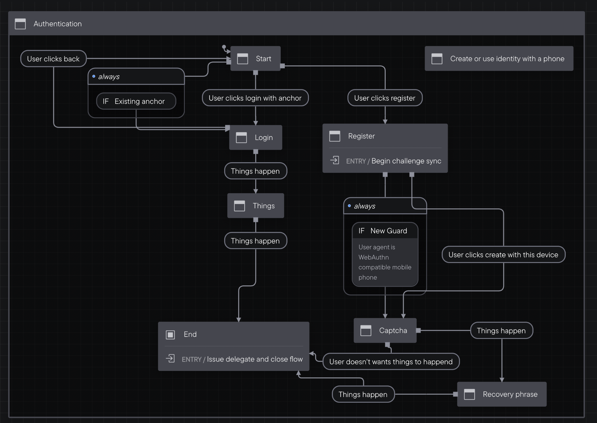

A very simple demo using xstate and finite state machines to power a React app. The state machine was created using the stately.ai visual editor:


[Edit the machine here](https://stately.ai/registry/editor/share/1134cd70-2b35-40f4-8590-dba9896f1f6e)

We render a different screen for each state, and push events to the state machine to navigate between them:


[View demo](https://xstate-demo-ee7hxrk6n-sagacards.vercel.app/)

# Local Dev

```
npm i
npm run dev
```